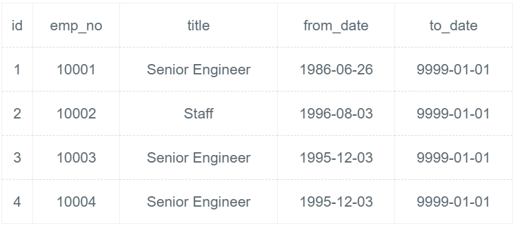

# [SQL42：删除emp_no重复的记录，只保留最小的id对应的记录。](https://www.nowcoder.com/practice/3d92551a6f6d4f1ebde272d20872cf05?tpId=82&&tqId=29810&rp=1&ru=/ta/sql&qru=/ta/sql/question-ranking)

## 1、题目

删除 emp_no 重复的记录，只保留最小的 id 对应的记录。

```sql
CREATE TABLE IF NOT EXISTS titles_test (
id int(11) not null primary key,
emp_no int(11) NOT NULL,
title varchar(50) NOT NULL,
from_date date NOT NULL,
to_date date DEFAULT NULL);

insert into titles_test values ('1', '10001', 'Senior Engineer', '1986-06-26', '9999-01-01'),
('2', '10002', 'Staff', '1996-08-03', '9999-01-01'),
('3', '10003', 'Senior Engineer', '1995-12-03', '9999-01-01'),
('4', '10004', 'Senior Engineer', '1995-12-03', '9999-01-01'),
('5', '10001', 'Senior Engineer', '1986-06-26', '9999-01-01'),
('6', '10002', 'Staff', '1996-08-03', '9999-01-01'),
('7', '10003', 'Senior Engineer', '1995-12-03', '9999-01-01');
```

删除后titles_test表为:




## 2、题解


```sql
DELETE FROM titles_test 
WHERE id NOT IN (
    SELECT * 
    FROM(
        SELECT MIN(id) 
        FROM titles_test 
        GROUP BY emp_no
) AS a);
```

## 3、涉及内容