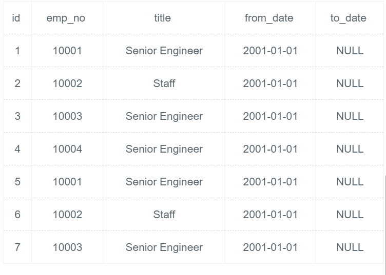

# [SQL43：将所有to_date为9999-01-01的全部更新为NULL,且 from_date更新为2001-01-01。](https://www.nowcoder.com/practice/859f28f43496404886a77600ea68ef59?tpId=82&&tqId=29811&rp=1&ru=/ta/sql&qru=/ta/sql/question-ranking)

## 1、题目

将所有 to_date 为 9999-01-01 的全部更新为 NULL，且 from_date 更新为 2001-01-01。

```sql
CREATE TABLE IF NOT EXISTS titles_test (
id int(11) not null primary key,
emp_no int(11) NOT NULL,
title varchar(50) NOT NULL,
from_date date NOT NULL,
to_date date DEFAULT NULL);

insert into titles_test values ('1', '10001', 'Senior Engineer', '1986-06-26', '9999-01-01'),
('2', '10002', 'Staff', '1996-08-03', '9999-01-01'),
('3', '10003', 'Senior Engineer', '1995-12-03', '9999-01-01'),
('4', '10004', 'Senior Engineer', '1995-12-03', '9999-01-01'),
('5', '10001', 'Senior Engineer', '1986-06-26', '9999-01-01'),
('6', '10002', 'Staff', '1996-08-03', '9999-01-01'),
('7', '10003', 'Senior Engineer', '1995-12-03', '9999-01-01');
```

更新后的值:
titles_test 表的值：




## 2、题解


```sql
update titles_test set to_date=null,from_date='2001-01-01' 
where to_date = '9999-01-01'
```

## 3、涉及内容