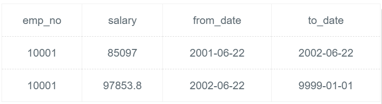

# [SQL48：将所有获取奖金的员工当前的薪水增加10%](https://www.nowcoder.com/practice/d3b058dcc94147e09352eb76f93b3274?tpId=82&&tqId=29816&rp=1&ru=/ta/sql&qru=/ta/sql/question-ranking)

## 1、题目

请你写出更新语句，将所有获取奖金的员工当前的(salaries.to_date='9999-01-01')薪水增加10%。(emp_bonus 里面的 emp_no 都是当前获奖的所有员工)

```sql
create table emp_bonus(
emp_no int not null,
btype smallint not null);

CREATE TABLE `salaries` (
`emp_no` int(11) NOT NULL,
`salary` int(11) NOT NULL,
`from_date` date NOT NULL,
`to_date` date NOT NULL, PRIMARY KEY (`emp_no`,`from_date`));
```

如：
```sql
INSERT INTO emp_bonus VALUES (10001,1);
INSERT INTO salaries VALUES(10001,85097,'2001-06-22','2002-06-22');
INSERT INTO salaries VALUES(10001,88958,'2002-06-22','9999-01-01');
```

更新后的结果:
salaries:



## 2、题解


```sql
update salaries set salary = salary * 1.1 
where salaries.to_date='9999-01-01' and emp_no in (select emp_no from emp_bonus)
```

## 3、涉及内容