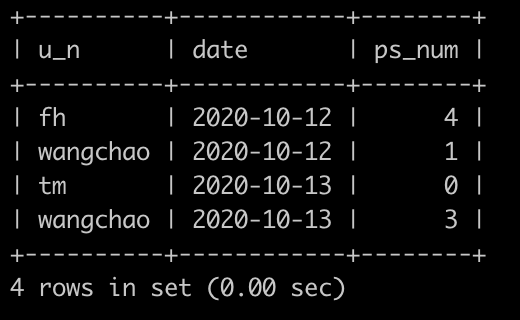

# [SQL71：牛客每个人最近的登录日期(六)](https://www.nowcoder.com/practice/572a027e52804c058e1f8b0c5e8a65b4?tpId=82&&tqId=35089&rp=1&ru=/ta/sql&qru=/ta/sql/question-ranking)

## 1、题目

牛客每天有很多人登录，请你统计一下牛客每个用户查询刷题信息，包括: 用户的名字，以及截止到某天，累计总共通过了多少题。 不存在没有登录却刷题的情况，但是存在登录了没刷题的情况，不会存在刷题表里面，有提交代码没有通过的情况，但是会记录在刷题表里，只不过通过数目是0。

有一个登录(login)记录表，简况如下:


第1行表示id为2的用户在2020-10-12使用了客户端id为1的设备登录了牛客网

。。。

第5行表示id为3的用户在2020-10-13使用了客户端id为2的设备登录了牛客网


有一个刷题（passing_number)表，简况如下:


第1行表示id为2的用户在2020-10-12通过了4个题目。

。。。

第3行表示id为1的用户在2020-10-13提交了代码但是没有通过任何题目。

第4行表示id为4的用户在2020-10-13通过了2个题目


还有一个用户(user)表，简况如下:


请你写出一个sql语句查询刷题信息，包括: 用户的名字，以及截止到某天，累计总共通过了多少题，并且查询结果先按照日期升序排序，再按照姓名升序排序，有登录却没有刷题的哪一天的数据不需要输出，上面的例子查询结果如下:



查询结果表明:

fh在2020-10-12为止，总共通过了4道题，输出为4

wangchao在2020-10-12为止，总共通过了1道题，总计为1

tm在2020-10-12为止只登陆了没有刷题，故没有显示出来

tm在2020-10-13为止刷了题，但是却没有通过任何题目，总计为0

wangchao在2020-10-13通过2道，但是加上前面2020-10-12通过1道，故在2020-10-13为止总共通过了3道题，总计为3

## 2、题解

需要累加，考虑聚合函数做窗口函数。


```sql
select name as u_n, date,
    sum(number) over(partition by user_id order by date) ps_num
from (
    select a.user_id,a.date,b.number,c.name 
    from login a
join passing_number b 
    on a.user_id=b.user_id and a.date=b.date
join user c 
    on a.user_id=c.id) t
order by date,name;

```

## 3、涉及内容