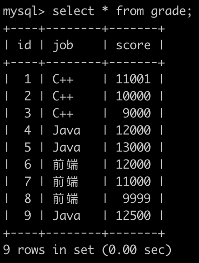
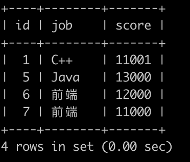

# [SQL73：考试分数(二)](https://www.nowcoder.com/practice/f456dedf88a64f169aadd648491a27c1?tpId=82&&tqId=35493&rp=1&ru=/ta/sql&qru=/ta/sql/question-ranking)

## 1、题目

牛客每次考试完，都会有一个成绩表(grade)，如下:



第1行表示用户id为1的用户选择了C++岗位并且考了11001分

。。。

第8行表示用户id为8的用户选择了前端岗位并且考了9999分

请你写一个sql语句查询用户分数大于其所在工作(job)分数的平均分的所有grade的属性，并且以id的升序排序，如下:



(注意: sqlite 1/2得到的不是0.5，得到的是0，只有`1*1.0/2`才会得到0.5，sqlite四舍五入的函数为round)

## 2、题解


```sql
-- 使用 join
select a.id,a.job,a.score
from grade a
join (select job,avg(score) avg from grade group by job) b 
on a.job=b.job and a.score>b.avg
order by a.id;

-- 使用 left join
select a.id,a.job,a.score
from grade a
left join (select job,avg(score) avg
    from grade 
    group by job) b
on a.job=b.job
where a.score > b.avg
order by a.id;

-- 使用 where
select g.id, g.job,g.score from grade g  
where g.score>(
	select avg(score) from grade g2 
	group by g2.job having g2.job=g.job) 
order by g.id asc;
```

## 3、涉及内容