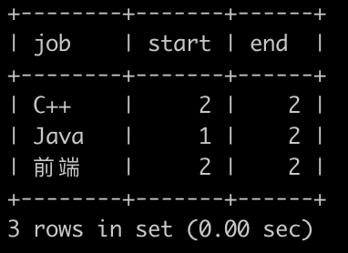

# [SQL75：考试分数(四)](https://www.nowcoder.com/practice/502fb6e2b1ad4e56aa2e0dd90c6edf3c?tpId=82&&tqId=35495&rp=1&ru=/ta/sql&qru=/ta/sql/question-ranking)

## 1、题目

牛客每次考试完，都会有一个成绩表(grade)，如下:


第1行表示用户id为1的用户选择了C++岗位并且考了11001分
。。。

第8行表示用户id为8的用户选择了前端岗位并且考了9999分

请你写一个sql语句查询各个岗位分数升序排列之后的中位数位置的范围，并且按job升序排序，结果如下:


 
解释:

第1行表示C++岗位的中位数位置范围为[2,2]，也就是2。因为C++岗位总共3个人，是奇数，所以中位数位置为2是正确的(即位置为2的10000是中位数)

第2行表示Java岗位的中位数位置范围为[1,2]。因为Java岗位总共2个人，是偶数，所以要知道中位数，需要知道2个位置的数字，而因为只有2个人，所以中位数位置为[1,2]是正确的(即需要知道位置为1的12000与位置为2的13000才能计算出中位数为12500)

第3行表示前端岗位的中位数位置范围为[2,2]，也就是2。因为前端岗位总共3个人，是奇数，所以中位数位置为2是正确的(即位置为2的11000是中位数)

(注意: sqlite 1/2得到的不是0.5，得到的是0，只有`1*1.0/2`才会得到0.5，sqlite四舍五入的函数为round，sqlite不支持floor函数，支持cast(x as integer) 函数，不支持if函数，支持case when ...then ...else ..end函数)

## 2、题解

【取一个范围】

```sql
select job,
if(count(*) MOD 2=0,count(*) DIV 2,count(*) DIV 2 +1) start,
if(count(*) MOD 2=0,count(*) DIV 2 +1,count(*) DIV 2 +1) end
from grade
group by job
order by job;

-- start和end的计算方法更优
SELECT job,FLOOR((COUNT(*)+1)/2) AS `start`,
FLOOR((COUNT(*)+1)/2)+if(COUNT(*) % 2=1,0,1) AS `end` 
from grade  
GROUP BY job 
order by job;

select job,(max(seq)+min(seq))/2 as start,
printf("%d",round((max(seq)+min(seq))*1.0/2)) as end 
from 
(select id,job,score,count() over(partition by job order by score asc) as seq from grade) as t 
group by job;
```

## 3、涉及内容

(1)IF

	IF(expr1,expr2,expr3)

如果expr1的值为true，则返回expr2的值，如果expr1的值为false，则返回expr3的值。

【case when】

(2)运算符

	=	    等于	
	<>, !=	不等于

	除
	mysql> select 2/3;
	+--------+
	| 2/3    |
	+--------+
	| 0.6667 |
	+--------+

	商
	mysql> select 10 DIV 4;
	+----------+
	| 10 DIV 4 |
	+----------+
	|        2 |
	+----------+

	取余
	mysql> select 10 MOD 4;
	+----------+
	| 10 MOD 4 |
	+----------+
	|        2 |
	+----------+