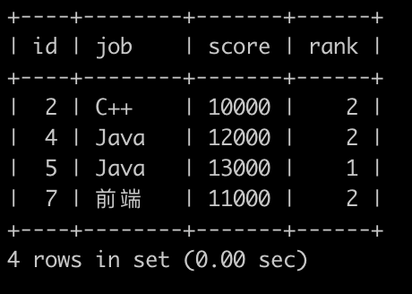

# [SQL76：考试分数(五)](https://www.nowcoder.com/practice/b626ff9e2ad04789954c2132c74c0512?tpId=82&&tqId=35496&rp=1&ru=/ta/sql&qru=/ta/sql/question-ranking)

## 1、题目

牛客每次考试完，都会有一个成绩表(grade)，如下:


第1行表示用户id为1的用户选择了C++岗位并且考了11001分

。。。

第8行表示用户id为8的用户选择了前端岗位并且考了9999分


请你写一个sql语句查询各个岗位分数的中位数位置上的所有grade信息，并且按id升序排序，结果如下:



解释：

第1行表示C++岗位的中位数位置上的为用户id为2，分数为10000，在C++岗位里面排名是第2

第2，3行表示Java岗位的中位数位置上的为用户id为4,5，分数为12000,13000，在Java岗位里面排名是第2,1

第4行表示前端岗位的中位数位置上的为用户id为7，分数为11000，在前端岗位里面排名是第2

(注意: sqlite 1/2得到的不是0.5，得到的是0，只有`1*1.0/2`才会得到0.5，sqlite四舍五入的函数为round，sqlite不支持floor函数，支持cast(x as integer) 函数，不支持if函数，支持case when ...then ...else ..end函数，sqlite不支持自定义变量)

## 2、题解

【取一个在一个范围内的值】

```sql
-- 先使用窗口函数，在各窗口内排名，要降序，
-- 再join包含中位数索引的表。
-- 最后过滤出在开始和结束索引中的数据。
select a.id,a.job,a.score,a.rank 
from (select id,job,score,
dense_rank() over(partition by job order by score desc) 'rank' from grade) a 
join (select job,
FLOOR((COUNT(*)+1)/2) 'start',
FLOOR((COUNT(*)+1)/2)+if(COUNT(*) % 2=1,0,1) 'end' 
from grade group by job) b 
on a.job=b.job
where a.rank=b.start or a.rank=b.end
-- on a.job=b.job and (a.rank between b.start and b.end)
order by a.id;

-- 在 between 取中位数索引
select a.id,a.job,a.score,a.rank 
from (select id,job,score,
dense_rank() over(partition by job order by score desc) 'rank' 
from grade) a 
where a.rank 
between 
(select FLOOR((COUNT(*)+1)/2) 'start' from grade b where a.job=b.job GROUP BY b.job) 
and 
(select FLOOR((COUNT(*)+1)/2)+if(COUNT(*) % 2=1,0,1) 'end' from grade c where a.job=c.job GROUP BY c.job) 
order by a.id;
```

## 3、涉及内容

(1)as取别名

取到mysql关键字时，加引号

(2) BETWEEN ... AND 

会选取介于两个值之间的数据范围。这些值可以是数值、文本或者日期。

	SELECT column_name(s)
	FROM table_name
	WHERE column_name
	BETWEEN a AND b

不同的数据库对 BETWEEN...AND 操作符的处理方式是有差异的。

某些数据库会列出介于 ab 之间的人，但不包括 ab；

某些数据库会列出介于 ab 之间，并包括 a 和 b 的人；

而另一些数据库会列出介于 ab 之间的人，包括 a ，但不包括 b 。